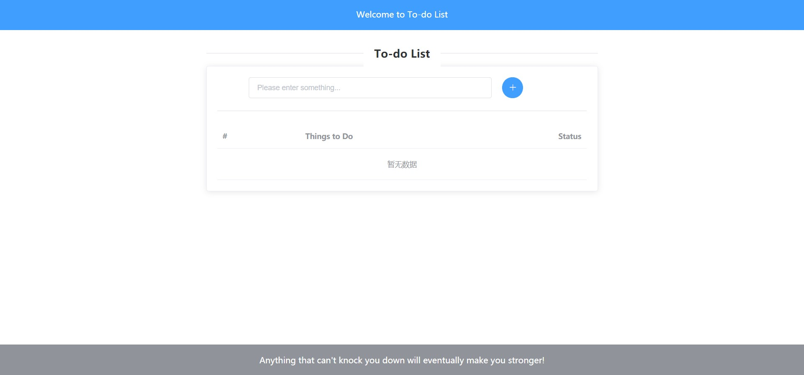
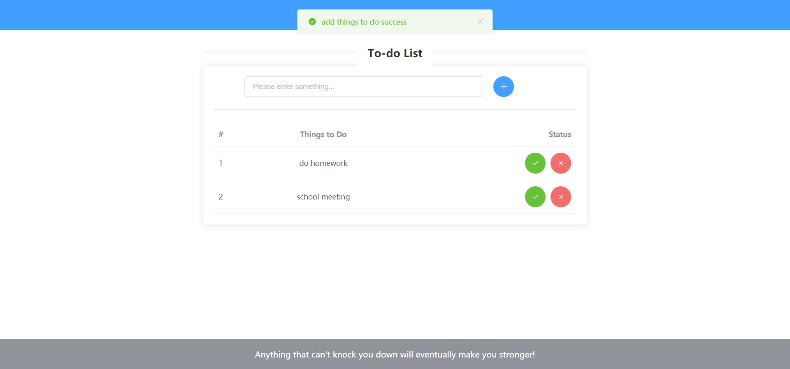
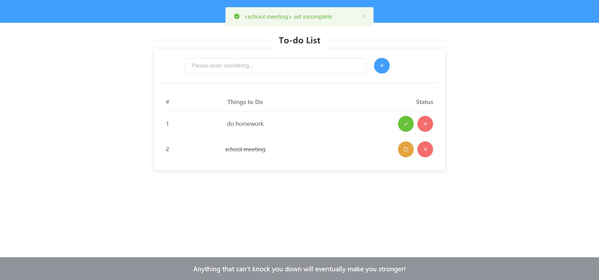

<!--
 * @Author: Liu Yuchen
 * @Date: 2021-04-03 22:16:25
 * @LastEditors: Liu Yuchen
 * @LastEditTime: 2021-04-28 04:44:41
 * @Description: reeadme file
 * @FilePath: /toDoList/README.md
 * @GitHub: https://github.com/liuyuchen777
-->
# toDoList

golang based web to-do list

MVC backend structure

## Introduction
frontend use vue and javascript

backend use golang

database use grom with mysql

## Use

```bash
go run main.go
# or
go build main.go
./main
```

## Demo Pictures






